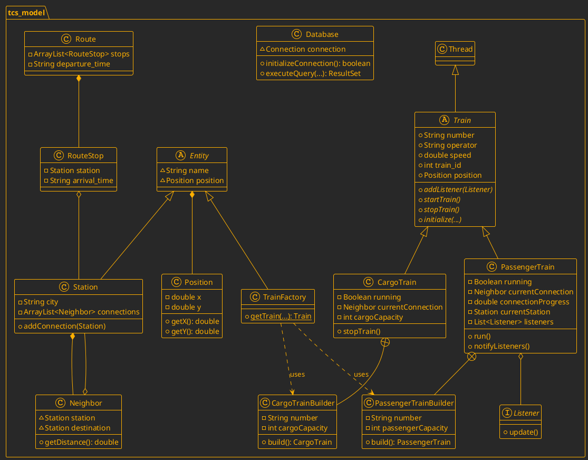

# TCS__Train-Control-System

```plantuml
@startuml
!theme crt-amber

package tcs_model {

    abstract class Entity {
        ~ String name
        ~ Position position
    }

    class Position {
        - double x
        - double y
        + getX(): double
        + getY(): double
    }

    abstract class Train extends Thread {
        + String number
        + String operator
        + double speed
        + int train_id
        + Position position
        + {abstract} addListener(Listener)
        + {abstract} startTrain()
        + {abstract} stopTrain()
        + {abstract} initialize(...)
    }

    class PassengerTrain extends Train {
        - Boolean running
        - Neighbor currentConnection
        - double connectionProgress
        - Station currentStation
        - List<Listener> listeners
        + run()
        + notifyListeners()
    }

    class PassengerTrainBuilder {
        - String number
        - int passengerCapacity
        + build(): PassengerTrain
    }

    class CargoTrain extends Train {
        - Boolean running
        - Neighbor currentConnection
        - int cargoCapacity
        + stopTrain()
    }

    class CargoTrainBuilder {
        - String number
        - int cargoCapacity
        + build(): CargoTrain
    }

    class Station extends Entity {
        - String city
        - ArrayList<Neighbor> connections
        + addConnection(Station)
    }

    class Neighbor {
        ~ Station station
        ~ Station destination
        + getDistance(): double
    }

    class TrainFactory extends Entity {
        + {static} getTrain(...): Train
    }

    interface Listener {
        + update()
    }

    class Database {
        ~ Connection connection
        + initializeConnection(): boolean
        + executeQuery(...): ResultSet
    }

    class Route {
        - ArrayList<RouteStop> stops
        - String departure_time
    }

    class RouteStop {
        - Station station
        - String arrival_time
    }

    ' Relationships
    Entity *-- Position
    PassengerTrain +-- PassengerTrainBuilder
    CargoTrain +-- CargoTrainBuilder
    Station *-- Neighbor
    Neighbor o-- Station
    PassengerTrain o-- Listener
    Route *-- RouteStop
    RouteStop o-- Station
    TrainFactory ..> PassengerTrainBuilder : uses
    TrainFactory ..> CargoTrainBuilder : uses
}
@enduml
```